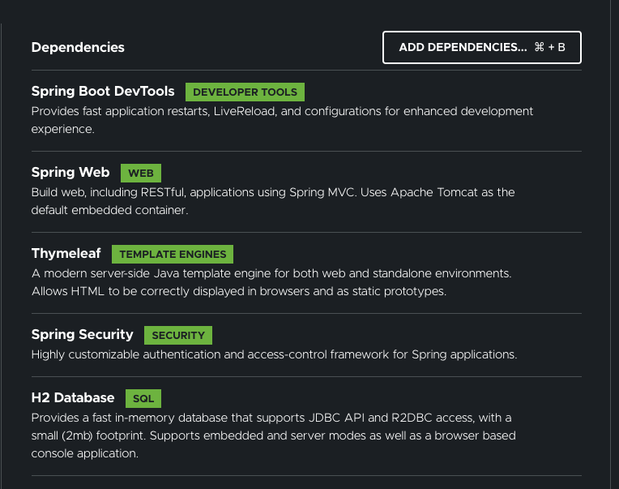

# ng-rdx-mat-spring-task

# Introduction
Recently I explored a consulting engagement with a company using the `React` / `Redux` / `Material` / `Spring Boot`; although I've been writing user experience software for a long time, other than a brief `React` assessment in '15, I had no experience with any of these technologies. 

Even though the engagement did not pan out, I decided to learn the `React` / `Redux` / `Material` / `Spring Boot`, found the [React.js and Spring Data REST](https://spring.io/guides/tutorials/react-and-spring-data-rest/) blog, and decided to use it as the basis for me to build a `Todo` application using these technologies. I started with `React` and `Spring`, which is the basis of the blog, then integrated `Redux`, then `Material UI`, and finally I added a `CI/CD` that deploys my [Todo application](https://github.com/RodrigoMattosoSilveira/react-rdx-mat-spring-todo) to [Heroku](https://react-springboot-todo.herokuapp.com//); there are two users: `donald / trump` and `nancy / pelosi`.

Once I completed my `Todo` application I decided to migrate it to `Angular` / `Redux` / `Material` / `Spring Boot`; although the idea seems simple, I learned that integrating `Angular` and `Spring Boot` is more complicated:
* **Project Structure** - The application requires two modules, `frontend` and `backend`, managed by technolgies with different views about file placement;
* **Technology Cooperation** - We use `angular-cli` to manage the `frontend` and `maven` the backend; they rely on `Node.js` and `Tomcat`, respectively, to build and serve the `frontend` and `backend`; their workflows are also different;
* **NGRX** - Although the principles are the same, I learned about `selectors` and `effects`, both available in `React` but which I did not use, which have deep architectural implications;
* **Angular Material** - It is very different than `Material UI`, hence forcing us to rewrite the UI; although this seems hard, it a welcome opportunity to de-couple data accesss and filtering logic from the components;
## Project Structure
I invest a fair amount of time looking for a `natural` way to use `angular-cli` and `spring-initializr` to create the `frontend` and `backend` modules. Eventually I decided to adopt the framework suggested in the [Integrate Angular with a Spring Boot project](https://keepgrowing.in/java/springboot/integrate-angular-with-a-spring-boot-project/):
````text
|- <project root>
   |- backend
   |- frontend
   ...
````
We use `angular-cli` and `spring-initializr`, move files around, and glue them using the wonderful [frontend-maven-plugin](https://github.com/eirslett/frontend-maven-plugin);

## Technology Cooperation
We will address this based on the workflow:
* **Development** - We will work on multiple terminal windows, each handling its own work using the right tools for it; we will rely on `ng` to build and test the `frontend` and `mvn` to build and test the `backend`; we wil rely on `Node,js` to serve the `frontend` and `Tomcat` the backend, and will use `CORS` to mitigate the same-origin issue that would arise from this setup; 
* **Deployment** - We will use the `Maven` `frontend-maven-plugin` to drive the `frontend` build and test, while still relying on `Node.js` to support these task, and use `mvn` to build and test the backend, build the jar;
* **Production** - `Tomcat` will host the `backend` and serve the `frontend`;

## NGRX
* **Selectors** - We will use [selectors](https://github.com/reduxjs/reselect) to minimize the amount of state data, constraining ourselves to only raw data, using selectors to compute derived data, and removing these operations from components. An example is a component that renders `tasks` with the functionality to filter them by state; by setting task list and the task state as simple states, we can build a selector that filters `completed` tasks and de-coupling this logic from the component, also making it easier to test it;
* **Effects** - We will use `effects` to execute logic required prior, `REST call` or after event, `WEBSOCKET event`, again decoupling from `actions`, `reducers`, and `components, and, again, simplfying logic and testing;

## Angular Material
My original `Todo` application was a tour de force, quite ugly! We will strive for a more elegant approach.

# Project Structure
We will create the `backend` and `frontend`, grooming them to fit our target structure;
## Project root folder
Create the `project root folder`
````shell script
$ cd ~/projects
$ mkdir ng-rdx-mat-spring-task
````
Notes:
1. I'm a `MAC` user;
1. I keep all my projects on my `home's project folder`;
1. I named my `project root folder` `ng-rdx-mat-spring-task`;
1. Note that I used `tssk` instead of `todo` to overcome my IDE use of `todo` as a reserved word;

## Project repository
We will commit our work as we go along, you must have `git` installed:
````shell script
$ echo "# ng-rdx-mat-spring-task" >> README.md
$ git init
$ git add README.md
$ git commit -m "first commit"
$ git remote add origin git@github.com:RodrigoMattosoSilveira/ng-rdx-mat-spring-task.git
$ git push -u origin master
````

This yields the following:
````text
|- ng-rdx-mat-spring-task
   |- ./
   |- ../
   |- .git/
   README.md
````
Notes:
1. I used `ng-rdx-mat-spring-task` as my `project root name`;
1. My `GitHub` account is `https://github.com/RodrigoMattosoSilveira`; you have to substitute it for yours;

## Backend
### Steps
We will take the following steps:
1. Navigate to [Spring Boot Intializer]( https://start.spring.io);
1. Configure  the `backend` attributes (see below);
1. Configure the `backend` dependencies (see below);
1. Generate the `backend` configuration - [Spring Boot Intializer]( https://start.spring.io) saves it in your `~/Downloads` file;
1. Expand the `backend` configuration;
1. Copy the expanded `backend` configuration to your `~/projects/<project root>` folder;
1. Create the `backend` folder;
1. Move `src` to `backend`;
1. Copy `pom` to `backend`;
1. Edit `project root pom` to be the `parent of the backend pom`;
1. Edit `backend pom` to be the `child of the parent pom`;

### Backend Attribute Configuration


Notes:
1. You can use any valid `group name`; henceforth we will use refer to `com.madronetek` for the same of convenience;
1. You can use any valid `artifact name`; henceforth we will use refer to `task` because this is a blog about a `task` application;
1. I picked `Java 14` to stay abreast of the latest version;

### Backend Dependencies


Notes:
1. I selected these libraries because I used them in my original `Todo` project;

### Copy expanded backend configuration to project root
We will end up with the following:
````text
|- ng-rdx-mat-spring-task
   |- .git/
   |- .gitignore
   |- .idea/
   |- .mvn/
   |- HELP.md
   |- md-artifacts/
   |- mvnw
   |- mvnw.cmd
   |- pom.xml
   |- README.md
   |- src/
     |- main
     ... etc.
     |- test
````

### Set backend folder
Once we move the `src` folder to the `backend` folder and copy the `project root pom` to the 'backend' folder we have:
````text
|- ng-rdx-mat-spring-task
   |- .git/
   |- .gitignore
   |- .idea/
   |- .mvn/
   |- backend
      |- src/
         |- main
            ... etc.
         |- test
      |- pom.xml
   |- HELP.md
   |- md-artifacts/
   |- mvnw
   |- mvnw.cmd
   |- pom.xml
   |- README.md
````

### Set parent pom
We re-factor the original pom:
1. Remove dependencies, see the `backend` and `frontend` pom;
1. Remove the build, see the `backend` and `frontend` pom;
1. Add a few properties;
1. Connect it with its `backend` child;

````xml
<?xml version="1.0" encoding="UTF-8"?>
<project xmlns="http://maven.apache.org/POM/4.0.0" xmlns:xsi="http://www.w3.org/2001/XMLSchema-instance"
	xsi:schemaLocation="http://maven.apache.org/POM/4.0.0 https://maven.apache.org/xsd/maven-4.0.0.xsd">
	<modelVersion>4.0.0</modelVersion>
  
    <artifactId>task</artifactId>

    <name>task</name>
    <description>Learn how to use Angular, Redux, Material, Spring Boot, using a Task (e.g. Todo) app</description>

    <parent>
        <groupId>org.springframework.boot</groupId>
        <artifactId>spring-boot-starter-parent</artifactId>
        <version>2.3.3.RELEASE</version>
        <relativePath/> <!-- lookup parent from repository -->
    </parent>

	<groupId>com.madrone</groupId>
	<version>0.0.1-SNAPSHOT</version>

	<properties>
		<java.version>14</java.version>
	</properties>

    <modules>
        <module>backend</module>
    </modules>

</project>
````
### Set the backend pom
1. Set up the parent
1. Remove properties, since it inherits them its parent;

````xml
<?xml version="1.0" encoding="UTF-8"?>
<project xmlns="http://maven.apache.org/POM/4.0.0" xmlns:xsi="http://www.w3.org/2001/XMLSchema-instance"
	xsi:schemaLocation="http://maven.apache.org/POM/4.0.0 https://maven.apache.org/xsd/maven-4.0.0.xsd">
	<modelVersion>4.0.0</modelVersion>

    <artifactId>backend</artifactId>

    <name>backend</name>
    <description>Backend module</description>

    <parent>
        <groupId>com.madrone</groupId>
        <artifactId>task</artifactId>
        <version>0.0.1-SNAPSHOT</version>
    </parent>

	<dependencies>
		<dependency>
			<groupId>org.springframework.boot</groupId>
			<artifactId>spring-boot-starter-security</artifactId>
		</dependency>
		<dependency>
			<groupId>org.springframework.boot</groupId>
			<artifactId>spring-boot-starter-thymeleaf</artifactId>
		</dependency>
		<dependency>
			<groupId>org.springframework.boot</groupId>
			<artifactId>spring-boot-starter-web</artifactId>
		</dependency>

		<dependency>
			<groupId>org.springframework.boot</groupId>
			<artifactId>spring-boot-devtools</artifactId>
			<scope>runtime</scope>
			<optional>true</optional>
		</dependency>
		<dependency>
			<groupId>com.h2database</groupId>
			<artifactId>h2</artifactId>
			<scope>runtime</scope>
		</dependency>
		<dependency>
			<groupId>org.springframework.boot</groupId>
			<artifactId>spring-boot-starter-test</artifactId>
			<scope>test</scope>
			<exclusions>
				<exclusion>
					<groupId>org.junit.vintage</groupId>
					<artifactId>junit-vintage-engine</artifactId>
				</exclusion>
			</exclusions>
		</dependency>
		<dependency>
			<groupId>org.springframework.security</groupId>
			<artifactId>spring-security-test</artifactId>
			<scope>test</scope>
		</dependency>
	</dependencies>

	<build>
		<plugins>
			<plugin>
				<groupId>org.springframework.boot</groupId>
				<artifactId>spring-boot-maven-plugin</artifactId>
			</plugin>
		</plugins>
	</build>

</project>
````

## Frontend
### Steps
We will take the following steps:
1. Install  [Angular-CLI](https://angular.io/cli) globaly;
1. Create the `frontend/src/main` folder; this enables maven to manage it seamlessly;
1. Copy the `backend pom` to the `frontend` folder;
1. Refactor the `frontend pom`, tie it to its parent;
1. Generate the `angular frontend`;
1. Update the `frontend pom` to enable `maven` to build the project;
1. Re-factor the `angular control files` to ...

### Install the latest angular cli
If you do not have [Angular-CLI](https://angular.io/cli) installed, please do; if you do, please upgrade it to the most recent `release` version.

### Create the `frontend/src/main` folder, copy backend pom
We end up with:
```shell script
````text
|- ng-rdx-mat-spring-task
   |- .git/
   |- .gitignore
   |- .idea/
   |- .mvn/
   |- backend
      |- src/
         |- main
            ... etc.
         |- test
      |- pom.xml
   |- frontend
      |- src/
         |- main
      |- pom.xml
   |- HELP.md
   |- md-artifacts/
   |- mvnw
   |- mvnw.cmd
   |- pom.xml
   |- README.md
````

### Edit the frontend pom
We do the following edits:
1. change `<artifactId>` – to `frontend`;
1. change `<name>` – to `frontend`;
1. change `<description>` – to `Frontend module`;
1. remove the existing plugin, to have none; we will add a new one shortly;
1. Tie it to its parent;
1. Tie its parent to it;
1. Build `frontend` with Maven;
1. Refactor `angular.json` to align with `maven`;
1. Add `frontend` module dependency to `backend`

````xml
<?xml version="1.0" encoding="UTF-8"?>
<project xmlns="http://maven.apache.org/POM/4.0.0" xmlns:xsi="http://www.w3.org/2001/XMLSchema-instance"
	xsi:schemaLocation="http://maven.apache.org/POM/4.0.0 https://maven.apache.org/xsd/maven-4.0.0.xsd">
	<modelVersion>4.0.0</modelVersion>

    <artifactId>frontend</artifactId>

    <name>frontend</name>
    <description>Frontend module</description>

    <parent>
        <groupId>com.madrone</groupId>
        <artifactId>task</artifactId>
        <version>0.0.1-SNAPSHOT</version>
    </parent>

	<build>
		<plugins></plugins>
	</build>

</project>

````

### Tie the parent pom to the frontend pom
````xml
<?xml version="1.0" encoding="UTF-8"?>
<project xmlns="http://maven.apache.org/POM/4.0.0" xmlns:xsi="http://www.w3.org/2001/XMLSchema-instance"
	xsi:schemaLocation="http://maven.apache.org/POM/4.0.0 https://maven.apache.org/xsd/maven-4.0.0.xsd">
	<modelVersion>4.0.0</modelVersion>

    <artifactId>task</artifactId>

    <name>task</name>
    <description>Learn how to use Angular, Redux, Material, Spring Boot, using a Task (e.g. Todo) app</description>

    <parent>
        <groupId>org.springframework.boot</groupId>
        <artifactId>spring-boot-starter-parent</artifactId>
        <version>2.3.3.RELEASE</version>
        <relativePath/> <!-- lookup parent from repository -->
    </parent>

	<groupId>com.madrone</groupId>
	<version>0.0.1-SNAPSHOT</version>

	<properties>
		<java.version>14</java.version>
	</properties>

    <modules>
        <module>backend</module>
        <module>frontend</module>
    </modules>

</project>
````

### Generate the angular application
This is tricky since we want it is a specific location:
````shell script
$ cd frontend/src/main
$ ng new --skip-git app
````

Notes:
1. We are not doing this from the `project root` as it is often the case with `angular`;
1. We did configure the generator to not generate git repo since we already have one

### Generate the angular application .gitignore file
1. create a `.gitignore` file `frontend` 
Navigate to [this gitignore generator](https://www.toptal.com/developers/gitignore), select `angular` and node, generate the files, copy it, and past it on our `.gitignore`

### Build frontend with maven
We will use the excellent [frontend-maven-plugin](https://github.com/eirslett/frontend-maven-plugin) to build the frontend. It installs `node` and `npm` as well as builds our `angular project`. Be sure to include the latest tagged version of the plugin (I used 1.6) and add the following code from the <plugins> field to the frontend/pom.xml:
````xml
			<plugin>
				<groupId>com.github.eirslett</groupId>
				<artifactId>frontend-maven-plugin</artifactId>
				<version>1.9.1</version>
				<configuration>
					<workingDirectory>src/main/angular</workingDirectory>
					<nodeVersion>v12.14.1</nodeVersion>
					<npmVersion>6.13.7</npmVersion>
				</configuration>
				<executions>
					<execution>
						<id>install node and npm</id>
						<goals>
							<goal>install-node-and-npm</goal>
						</goals>
					</execution>
					<execution>
						<id>npm install</id>
						<goals>
							<goal>npm</goal>
						</goals>
					</execution>
					<execution>
						<id>npm run build</id>
						<goals>
							<goal>npm</goal>
						</goals>
						<configuration>
							<arguments>run build</arguments>
						</configuration>
					</execution>
				</executions>
			</plugin>

````
Notes:
1. Check the [Maven Frontend Plugin latest version](https://mvnrepository.com/artifact/com.github.eirslett/frontend-maven-plugin#:~:text=Maven%20Frontend%20Plugin%20This%20Maven%20plugin%20lets%20you,Karma%20tests.%20Central%20%2838%29%20Atlassian%203rd-P%20Old%20%282%29);
1. Check [Node.js](https://nodejs.org/en/) latest version;
1. `npm` is distributed with `Node.js`- which means that when you download `Node.js`, you automatically get `npm` installed on your computer;
1. `npm run build` calls the `npm run` command (don’t confuse it with `npm build`), which will run the angular `ng build` script to compile an application into an output directory. You can configure the build command in the frontend’s package.json file, so we will add the –prod option to uglify the javascript code; we will not do it so that we can debug it;

### Refactor `angular.json` to align with maven
To keep up with the `Maven` standards we need to alternate  `frontend/src/main/angular/angular.json` `outputPath` option for our Angular project, instead of `dist/angular` we use `../../../target/frontend`:

````json
…
"projects": {
    "angular": {
      "architect": {
        "build": {
          …
          "options": {
            "outputPath": "../../../target/frontend",
…
````
We have just changed the path for the built project, so we need to add the information about the new path to the frontend/pom.xml:

````xml
<!-- frontend/pom.xml -->
…
<build>
…
   <resources>
      <resource>
         <directory>target/frontend</directory>
         <targetPath>static</targetPath>
      </resource>
   </resources>
</build
````

### Add frontend module dependency to backend
````xml
<!-- backend/pom.xml -->
…
<dependencies>
…
   <dependency>
      <groupId>in.keepgrowing</groupId>
      <artifactId>frontend</artifactId>
      <version>${project.version}</version>
      <scope>runtime</scope>
   </dependency>
<dependencies>
````

### Ensure we can run e2e tests concurrently with the app
This is a nice to have, but can come in handy. Update the `package.json/scripts/e2e` script:
````json
   ...
   "e2e": "ng e2e --port 4201"
   ...
````

### Fix up the angular app output path
To keep up with the Maven standards we need to alternate the outputPath option for our Angular project, instead of "dist/angular" use `../../../target/frontend`:
```json
/ frontend/src/main/angular/angular.json
…
"projects": {
    "angular": {
      "architect": {
        "build": {
          …
          "options": {
            "outputPath": "../../../target/frontend",
…
```

# Links
## Blogs
  * [Building a Web Application with Spring Boot and Angular](https://www.baeldung.com/spring-boot-angular-web);
  * [How to structure a spring boot project](https://springhow.com/spring-boot-project-structure-and-convention/#:~:text=How%20to%20structure%20a%20spring%20boot%20project%3F%201,template%20engines%20by%20default.%20...%206%20pom.xml.%20) - The Spring Boot project folder convention;
  * [Introduction to Reactive Programming](https://dzone.com/articles/introduction-to-reactive-programming-2);
  * [Integrate Angular with a Spring Boot project](https://keepgrowing.in/java/springboot/integrate-angular-with-a-spring-boot-project/) - This repository is based on this blog;
  * [React.js and Spring Data REST](https://spring.io/guides/tutorials/react-and-spring-data-rest/) - The blog I based my `React` `Todo` project;
  * [React Redux Mat Spring Todo](https://github.com/RodrigoMattosoSilveira/react-rdx-mat-spring-todo/) - My `React` `Todo` project;
  * [React Redux Mat Spring Todo Heroku](https://react-springboot-todo.herokuapp.com/login)

## Technologies
  * [Anguar](https://angular.io/) - Application design framework and development platform for creating efficient and sophisticated single-page apps;
  * [Angular-CLI](https://angular.io/cli) - A command-line interface tool that you use to initialize, develop, scaffold, and maintain Angular applications directly from a command shell;
  * [Angular Material](https://material.angular.io/) - Material Design components for Angular;
  * [frontend-maven-plugin](https://github.com/eirslett/frontend-maven-plugin) - Maven plugin to support frontend development, leveraging Node.js, while decoupling it from the backend;
  * [Heroku](https://www.heroku.com/) - Platform as a service based on a managed container system, with integrated data services and a powerful ecosystem, for deploying and running modern apps;
  * [Material UI]() - Material Design components for React;
  * [Maven](https://maven.apache.org/) - A software project management and comprehension tool;
  * [ng](https://angular.io/cli) - Maven's counterpart in `angular-cli`;
  * [ngrx](https://ngrx.io/) - Reactive State for Angular;
  * [Node.js](https://nodejs.org/en/) - JavaScript runtime built on Chrome's V8 JavaScript engine.
  * [React](https://reactjs.org/) - A JavaScript library for building user interfaces;
  * [Redux](https://redux.js.org/) - A Predictable State Container for JS Apps;
  * [react-redux](https://react-redux.js.org/) - Official React bindings for Redux;
  * [Reselect](https://github.com/reduxjs/reselect) - Simple “selector” library for Redux (and others) inspired by getters in NuclearJS, subscriptions in re-frame and this proposal from speedskater;
  * [Spring Boot](https://spring.io/projects/spring-boot) - Makes it easy to create stand-alone, production-grade Spring based Applications that you can "just run";
  * [Spring Boot Initializer](https://start.spring.io/) - Creates the basic Spring Boot project framework;
  * [Tomcat](http://tomcat.apache.org/) - open source implementation of the Java Servlet, JavaServer Pages, Java Expression Language and Java WebSocket technolog

